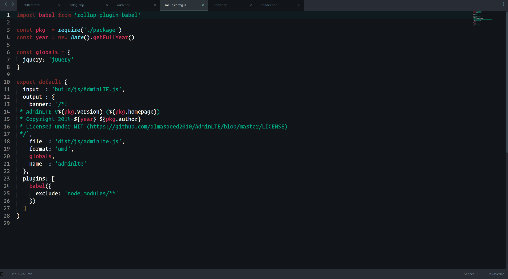

#### Ananazf - it's my theme for Sublime Text 

#### HOW TO USE:

`git clone https://github.com/Avdushin/Ananazf`

`cd Ananazf`

Copy ***Ananazfv1.tmTheme*** to your ST Packages.

Linux: 

`sudo cp -rf Ananazfv1.tmTheme /opt/sublime_text/Packages/`

Windows:

Preferences > Browse Packages...

#### Tested at:

- [x] Sublime Text 4
- [ ] Sublime Text 3 
- [ ] Sublime Text 2

#### DEMO:

Python:

HTML:

CSS:

Js:

PHP:

Shell:

GO:

Rust:

###### **© 2022 [Avdushin](https://github.com/Avdushin)** 

